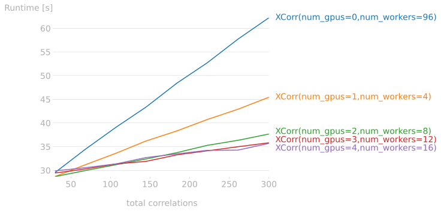

# rcc-xcorr
A Python library to compute normalized 2D cross-correlation of images using GPU acceleration and python multiprocessing.

**Contents**
1. [Requirements](#requirements)
2. [Installation](#installation)
3. [Usage](#usage)
4. [Benchmarks](#benchmarks)
   * [Benchmarking CPU vs GPU](#benchmarking-cpu-vs-gpu)
   * [Benchmarking Multi GPU](#benchmarking-multi-gpu)
5. [Options](#options)
   * [normalize_input](#normalize_input)
   * [crop_output](#crop_output)
   * [use_gpu](#use_gpu)
   * [group_correlations](#group_correlations)
   * [num_workers](#num_workers)
   * [num_gpus](#num_gpus)
   * [override_eps](#override_eps)
   * [custom_eps](#custom_eps)
6. [Tests](#tests)
   * [Test Cross Correlation (2D alignment)](#test_batch_xcorr)
   * [Test Cross Correlation (3D alignment)](#test_batch_xcorr_3dalign)

## Requirements
To accelerate correlations using GPU an NVIDIA GPU with CUDA 11.2+ libraries installed. 

The **rcc-xcorr** has been tested with Python 3.8

Additional requirements:
* cupy
* numpy
* scipy
* [GPUtil](https://github.com/anderskm/gputil) 
* [concurrent.futures](https://docs.python.org/3/library/concurrent.futures.html)
* tqdm (to run the test scripts)
* perfplot (to run the benchmark scripts)
* tifffile (to run the test scripts)
* dill (to run the test scripts)
* matplotlib (to run the test scripts)

## Installation
```bash
python -m pip install git+https://github.com/research-center-caesar/rcc-xcorr.git
```

***Note:***  Read this [post](https://adamj.eu/tech/2019/03/11/pip-install-from-a-git-repository/) to understand 
why ``python -m pip`` is preferred over just ``pip``.

## Usage

The **rcc-xcorr** tool takes as input a list of correlations, an array of images and an array of templates. 
The correlation list is a list of pairs, the first one correspond to the `image_id` (the image index within the images array),
the second correspond to a `template_id` (the template index within the templates array).

###Example:
````python
from rcc_xcorr.xcorr import BatchXCorr

import cupy as cp
import multiprocessing as mp


images       :  [numpy 2d-array]
templates    :  [numpy 2d-array]
correlations : [[0 1]
                [0 2] 
                [1 3]
                [1 2]
                [0 4]
                [2 0]]

use_gpu = True
num_gpus = cp.cuda.runtime.getDeviceCount()
num_workers = 4 * num_gpus if use_gpu else mp.cpu_count()

batch_correlations = BatchXCorr.BatchXCorr(images, templates, correlations[:sample_size],
                                           crop_output=(0, 0), use_gpu=use_gpu,
                                           num_gpus=num_gpus, num_workers=num_workers,
                                           group_correlations=False)
print(f'[BATCH_XCORR] {batch_correlations.description()}')
coords, peaks = batch_correlations.execute_batch() 
````

***Note:*** The order in which the **correlations** appear in the array is the same order in which 
the correlation results are returned to the calling program.

The program assumes all given `image_id` and `template_id` are valid indices inside the `images`/`templates` array.

## Benchmarks

The following are benchmarks showcasing the performance of the **rcc-xcorr* tool using different
configurations. The purpose is to illustrate how the input data and allocated computing resources
affect the **rcc-xcorr** performance.

### Benchmarking CPU vs GPU

The plot illustrates the **xcorr-tool** performance using CPU vs GPU and enabling grouping.

The performance gain by enabling grouping is small but noticeable in particular for a large number
of correlations. Also notice that for a small number of correlations (***correlations > 30***) the 
CPU mode has a better performance.

### Benchmarking Multi GPU

The plot illustrates the **xcorr-tool** performance using 1, 2, 3 or 4 GPU(s) devices.

The number of workers per gpu is a value dependent on the GPU at hand. The goal is to keep
the GPU always busy overlapping `host-to-device` copy operations using multiple worker processes
each of them streaming data to the GPU device in parallel.

## Options

The following options can be used to control the execution of the **rcc-xcorr** tool

### normalize_input 
***Syntax:*** `[normalize_input=True|False(default)]`

This option would take the mean and divide by the standard deviation of the `image`. 

### crop_output 
***Syntax:*** `[crop_output=(0, 0) (default)]`

Use this option to remove the border `(x_px, y_px)` pixels from the cross-correlation output.

### use_gpu 
***Syntax:*** `[use_gpu=True(default)|False]`

The **rcc-xcorr** tool supports a **CPU-ONLY** mode, which can be used in case the parallel computer system does not
count with a GPU. This also allows to have multiple instances of the **rcc-xcorr** tool running on a
given node. One of them using the GPU resources and a second one constrained only to use the CPU cores.

### group_correlations 
***Syntax:*** `[group_correlations=True|False(default)]`

This optimization can be used, in case the list of `correlations` contains multiple instances of correlations where an `image` is
compared against multiple `templates`.

In this option is enabled the **rcc-xcorr** tool first sort and group the `correlations` having the same `image`.
This optimization avoids duplicate transfer of data between the CPU and the GPU memory increasing the performance.

***NOTE:*** The final output preserves the order in which the `correlations` were originally entered.

### num_workers 
***Syntax:*** `[num_workers=4(default)]`

In case the `use_gpu` option is set to `True` the value used for `num_workers` should match the `num_gpus` value (`default=4`)
The workers are used in a round-robin fashion to dispatch individual `correlation` pairs to the device (GPU). 
In order to keep the GPU(s) working at their full capacity a sufficient amount of workers per GPU must be in place.
The amount of workers that would make GPU work at its full capacity depend on the GPU itself.
A rule of thumb is to use 3 workers per GPU device. 

***NOTE:*** Increasing the number of workers above the number for optimum performance will degrade the performance 
of the device due to context switching from the GPU scheduler.

### num_gpus 
***Syntax:*** `[num_gpus=TOTAL_SYSTEM_GPUS(default)]`

By default, the **rcc-xcorr** tool uses all the devices allocated by the job (all the devices available on the node). 
If the `num_gpus` is passed then the **rcc-xcorr** tool restricts itself to use the indicated number of devices 
at most. In case less devices are available then the value is used as an upper bound.

***NOTE:*** `allocated_devices=min(num_gpus, availabe_devices)`

### override_eps 
***Syntax:*** `[override_eps=True|False(default)]`

This flag is used to indicate the ***rcc-xcorr*** tool that a `custom_eps` value should be used instead.

### custom_eps 
***Syntax:*** `[custom_eps=1e-06(default)]`

This option is used together with the `override_eps` flag to adopt a custom eps value to obtain the mask used to avoid
zero divisions whenever small values are used in the denominator during the cross-correlation output normalization.

## Tests

The correctness of the **rcc-xcorr** tool has been test against data created with 
[emalign](https://github.com/research-center-caesar/emalign). The test scripts are:

### Test Cross Correlation (2D alignment)
Test data consists of xx correlations used during `emalign` 2D alignment.
[test_batch_xcorr.py](rcc_xcorr/test_batch_xcorr.py)

### Test Cross Correlation (3D alignment)
Test data consists of xx correlations used during `emalign` 3D alignment.
[test_batch_xcorr_3dalign.py](rcc_xcorr/test_batch_xcorr_3dalign.py)